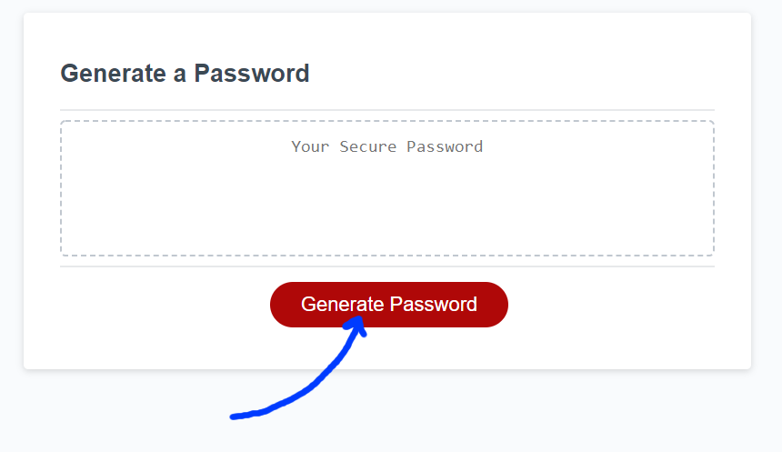

# Password Generator
## Version 1.0.0
#

This web application allows you to generate a random password based on your own password criteria. You must choose a password length between 8 and 128 characters, then you will be prompted with other information such as including symbols, numbers, letters, etc.

Get started! Click on the image below to use the application.

<a href="https://william-horn.github.io/user-password-generator/">

